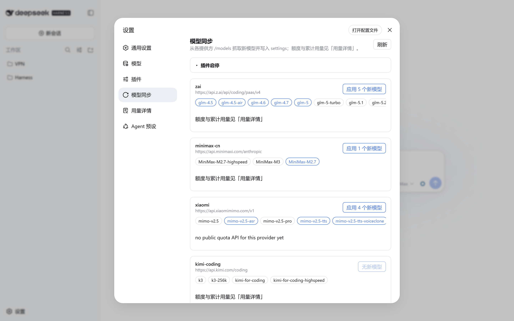
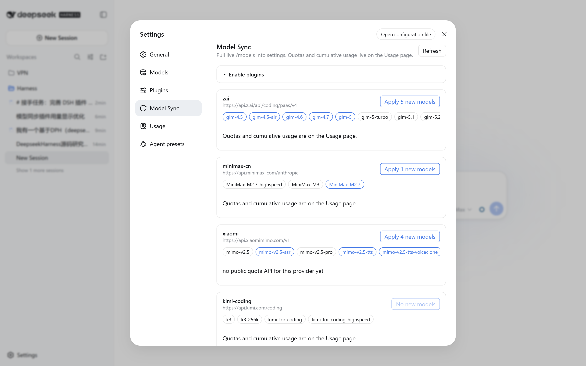
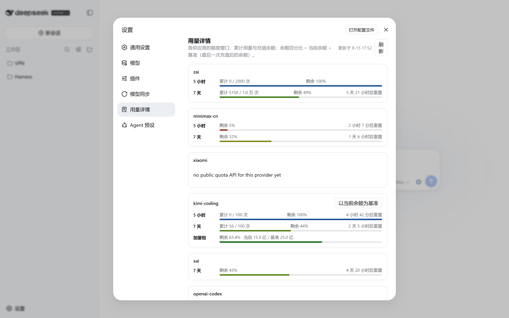
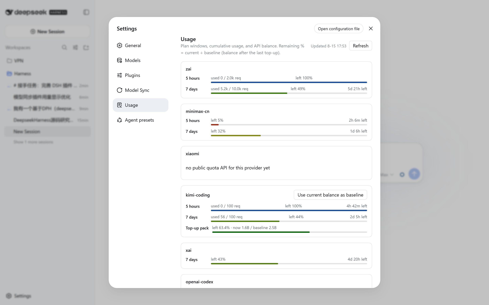
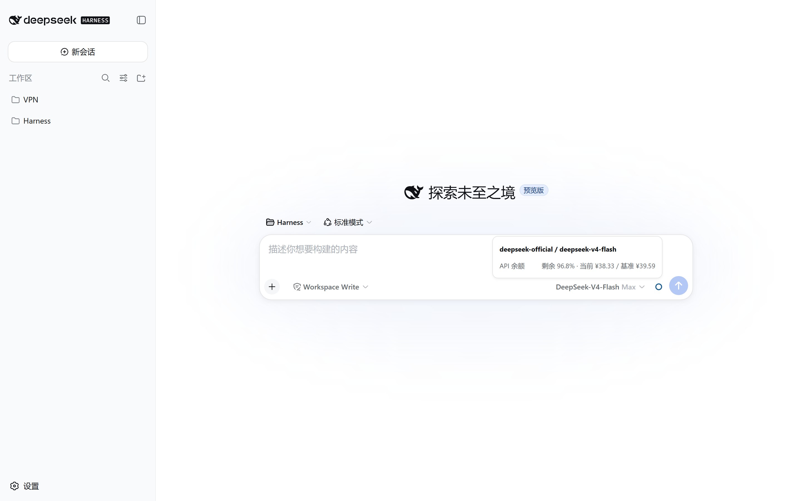
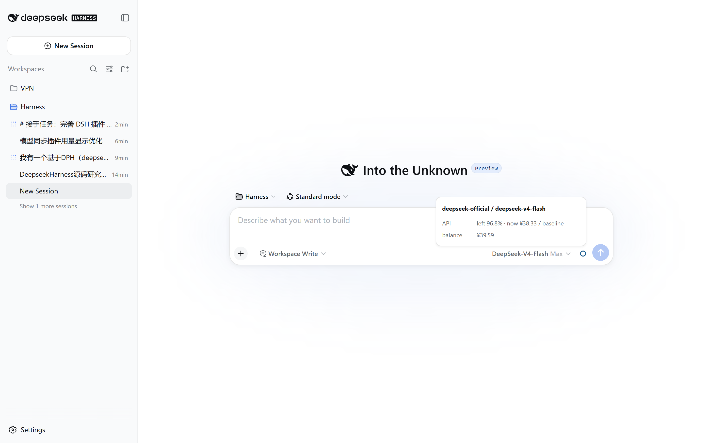

<p align="center">
  
</p>

<h1 align="center">dsh-model-sync</h1>

<p align="center">
  <a href="README.md">English</a> · 中文
</p>

<p align="center">
  <a href="https://www.npmjs.com/package/dsh-model-sync"></a>
  <a href="https://github.com/topics/dsh-plugin"></a>
  <a href="https://awesome-dsh-plugin.com"></a>
  <a href="LICENSE"></a>
</p>

<p align="center">
  把各提供方线上模型列表写进 DeepSeek Harness 的 settings。输入框圆环只跟当前会话正在用的那个模型，读套餐的 5 小时和 7 天窗口。按量线路读相对上次充值还剩多少。
</p>

<p align="center">
  
</p>

设置里两页。**模型同步**发现新模型 id 并写入，导航是同步箭头。**用量详情**列出各家窗口、累计次数和 API 余额，导航是清单。重置写成倒计时，例如 `2 天 3 小时后重置`。5 小时和 7 天各占一行。圆环在模型名右侧、上下文进度条左侧。

## 效果

| | 中文 | English |
|---|---|---|
| 模型同步 |  |  |
| 用量详情 |  |  |
| 输入框 |  |  |

一个额度画一环。同时有 5 小时和 7 天就画双环，内环 5 小时，外环 7 天。颜色按剩余比例走，0% 暗红，75% 绿，100% 天蓝或深蓝。窗口和加量包同时在时，图标只画窗口，加量包放在悬停卡。

## 安装

```sh
dsh plugin --profile web add dsh-model-sync
```

GitHub 源同样带预构建 `lib/`，不用开 `allowBuilds`。

```sh
dsh plugin --profile web add github:jiay98528-dev/dsh-model-sync
```

重启 `dsh web`，刷新页面，打开 **设置 → 模型同步**。

包声明了 `dsh.bundle` 和 `dsh.client.immediately: true`。

## 使用

### 模型同步

1. **设置 → 模型同步**。
2. 列表空就点 **刷新**。
3. 每张卡片给出提供方 id、`baseURL`、模型芯片。蓝框是 settings 里还没有的 id。**应用 N 个新模型**把它们写进 `llm-pi-ai.providers.<id>.models`。
4. 折叠的 **插件启停** 开关本插件和可选的 `sub-model-access`，热生效。

MiniMax、Kimi Coding、OpenAI Codex 没有 OpenAI `/models`，插件用 catalog 里的已知 id。

### 用量详情

1. **设置 → 用量详情**。
2. 每家给出 5 小时和 7 天剩余百分比、厂商上报的累计次数、重置倒计时、彩色进度条。两个窗口各占一行。
3. 按量行写 `当前 / 基准`。首采把当时余额当基准。要把已经花掉的部分算进百分比，点 **以当前余额为基准**。

### 对话圆环

1. 照常选模型。
2. 圆环在模型名右侧、上下文进度条左侧。
3. 悬停标题是本会话的 `提供方 / 模型`。每个窗口单独一行，例如 `5 小时    剩余 100% · 2 小时 15 分后重置`。
4. 换模型圆环跟着变。其它提供方在用量详情里。

## 额度从哪来

| 提供方 | 图标 | 接口 |
|---|---|---|
| `openai-codex` | 5h / 7d | `chatgpt.com/backend-api/wham/usage` |
| `kimi-coding` | 5h / 7d，加量包在悬停卡 | `api.kimi.com/coding/v1/usages` |
| `zai` | 5h / 7d | `api.z.ai/api/monitor/usage/quota/limit` |
| `minimax-cn` | 5h / 7d | `api.minimaxi.com/v1/api/openplatform/coding_plan/remains` |
| `xai` | 7d | grok.com gRPC-web，移植自 CC Switch |
| `deepseek-official` | 余额对照上次充值 | `api.deepseek.com/user/balance` |
| `xiaomi` | 无窗口数据 | 没有公开套餐接口 |

DeepSeek 按量基准写在 `$DSH_HOME/profiles/<profile>/model-sync.baseline.json`。读数高于已存基准，按充值处理。

## 配置

```yaml
- id: model-sync
  name: dsh-model-sync
  config:
    profile: web
    pollMs: 60000
```

| 字段 | 默认 | 含义 |
|---|---|---|
| `profile` | `web` | 读写哪个 `$DSH_HOME/profiles/<name>` |
| `pollMs` | `60000` | 额度刷新间隔，最小 `5000` |

## 说明

- Host 代码在 `node_modules` 里。改完并 `pnpm build` 后重启 `dsh web`。只改前端刷新页面。
- 额度请求使用 DSH 里已有凭据。
- 圆环位置绑在 DSH 0.1.0-rc.6 的 composer 类名上。
- 变更记录见 [CHANGELOG.md](CHANGELOG.md)。

## 许可

MIT
