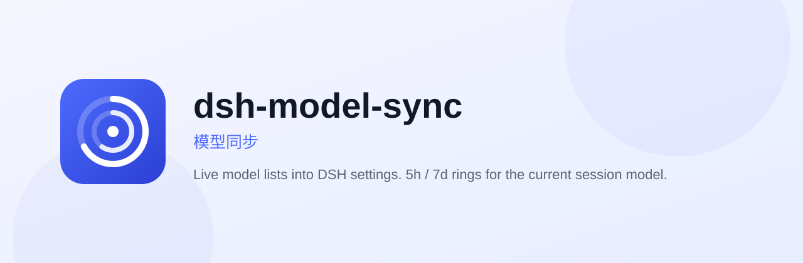
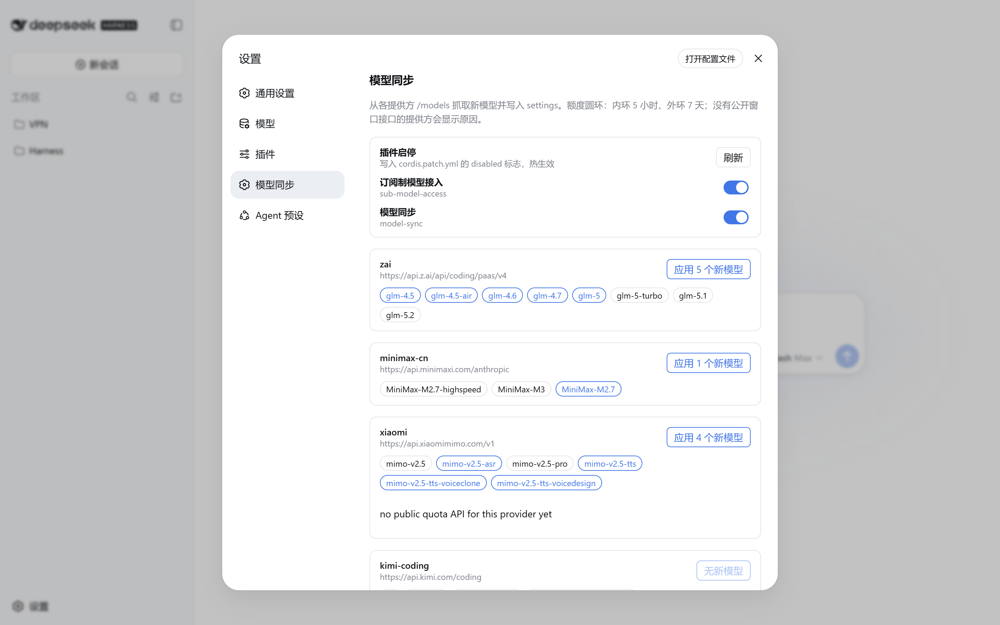
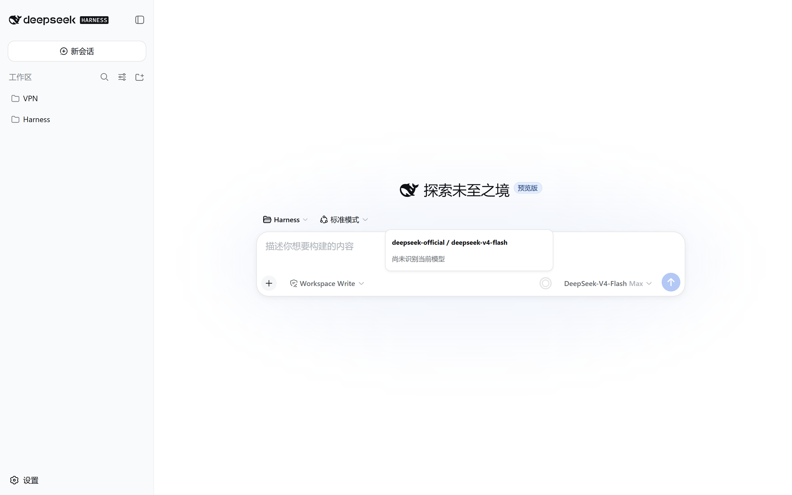

<p align="center">
  
</p>

<h1 align="center">dsh-model-sync</h1>

<p align="center">
  <a href="README.md">English</a> · 中文
</p>

<p align="center">
  <a href="https://www.npmjs.com/package/dsh-model-sync"></a>
  <a href="https://github.com/topics/dsh-plugin"></a>
  <a href="https://awesome-dsh-plugin.com"></a>
  <a href="LICENSE"></a>
</p>

<p align="center">
  把各提供方线上模型列表同步进 DeepSeek Harness 设置，并在输入框旁显示 <b>5 小时 / 7 天</b>额度圆环。对话里的圆环只跟<b>当前会话正在用的模型</b>。
</p>

<p align="center">
  
</p>

设置 → **模型同步** 展示全部已配置提供方：启停本插件、发现并写入新模型、查看各家额度。输入框旁的圆环只标注当前会话模型；全部家底仍在设置页。

## 效果

**设置页：发现并一键写入新模型**



**输入框：悬停圆环查看当前 `提供方 / 模型`**



内环是 5 小时，外环是 7 天。悬停标题为 `提供方 / 模型`。按量计费用「上次充值 = 100%」对照当前余额。

## 安装

npm（推荐，预构建，不用开 `allowBuilds`）：

```sh
dsh plugin --profile web add dsh-model-sync
```

GitHub（同样带 `lib/`，也不用 `allowBuilds`）：

```sh
dsh plugin --profile web add github:jiay98528-dev/dsh-model-sync
```

然后重启 `dsh web`，刷新页面，打开 **设置 → 模型同步**。

包已声明 `dsh.bundle`（`cordis.patch.yml`）和 `dsh.client.immediately: true`，设置页和圆环会自己挂上，不依赖别的包 inject。

## 使用

### 1. 设置页

1. 启动 `dsh web`，打开 **设置**。
2. 左侧点 **模型同步**。
3. 列表为空就点 **刷新**。
4. 每个提供方卡片会显示：
   - `id` 和 `baseURL`
   - 发现到的模型芯片（蓝框 = 设置里还没有的新 id）
   - **应用 N 个新模型**：把这些 id 写进 `llm-pi-ai.providers.<id>.models`
   - 额度 / 余额，或该家没有公开窗口接口时的原因
5. 顶部开关可启停 **模型同步** 以及可选的 **订阅制模型接入**（`sub-model-access`），写入对应行的 `disabled`，热生效。

没有 OpenAI `GET /models` 的协议（MiniMax、Kimi Coding、OpenAI Codex）会回落到 catalog 里的已知 id，不会标成红色「该协议没有 /models 列表」。

### 2. 对话圆环

1. 打开任意会话，照常选模型。
2. 输入框模型名左侧会出现双环。
3. 鼠标悬停或键盘聚焦，卡片标题是**本会话**的 `提供方 / 模型`。
4. 换模型，圆环跟着变。其它提供方请去设置页看。

如果悬停写着尚未识别当前模型，说明这个会话的提供方还不在发现列表里——去设置页刷新一次。

### 3. 额度从哪来

| 提供方 | 圆环数据 | 接口 |
|---|---|---|
| `openai-codex` | 5h / 7d 用量 | `chatgpt.com/backend-api/wham/usage` |
| `kimi-coding` | 5h / 7d 用量 | `api.kimi.com/coding/v1/usages` |
| `zai` | 5h / 7d 用量 | `api.z.ai/api/monitor/usage/quota/limit` |
| `minimax-cn` | 5h / 7d 剩余 | `api.minimaxi.com/v1/api/openplatform/coding_plan/remains` |
| `deepseek-official` | 余额对照上次充值 | `api.deepseek.com/user/balance` |
| `xai` | 只显示原因 | grok.com 的 gRPC 账单尚未接入 |
| 其它 | 只显示原因 | 还没有公开套餐窗口 |

套餐百分比对齐 [CC Switch](https://github.com/farion1231/cc-switch) 的计划接口。剩余 % = `100 − 已用`。智谱（`zai`）的 `Authorization` 必须是裸 key，不要加 `Bearer `。Codex 若本机有 `~/.codex/auth.json`，会读取其中的 `tokens.account_id`。

## 配置

在 profile 的 `cordis.patch.yml` 里按 id `model-sync` 覆盖：

```yaml
- id: model-sync
  name: dsh-model-sync
  config:
    profile: web
    pollMs: 60000
```

| 字段 | 默认 | 含义 |
|---|---|---|
| `profile` | `web` | 读写哪个 `$DSH_HOME/profiles/<name>` |
| `pollMs` | `60000` | 额度刷新间隔（最小 `5000`） |

## 说明

- Host 代码在 `node_modules` 里。改完并 `pnpm build` 后必须重启 `dsh web`。只改前端的话，刷新页面即可。
- 额度请求只用 DSH 里已经存好的凭据。Token 不会打进日志，也只发给该提供方自己的额度接口。
- 安装插件等于在你的机器上跑第三方代码。装到有密钥的环境前，先看一眼源码。

## 许可

MIT
